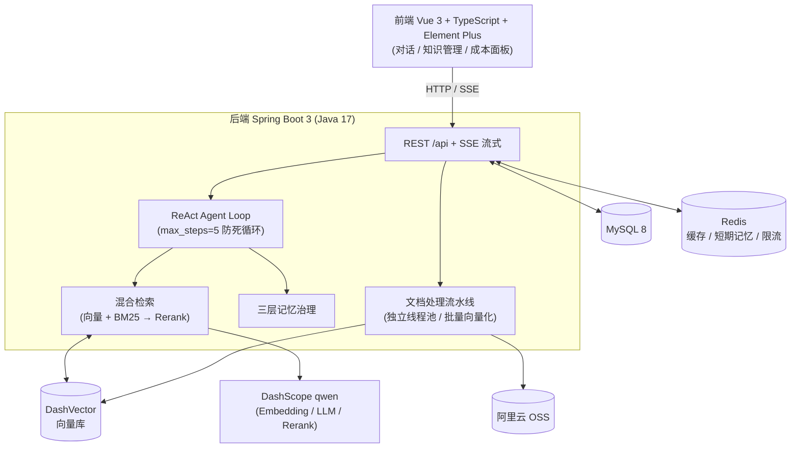
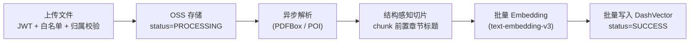
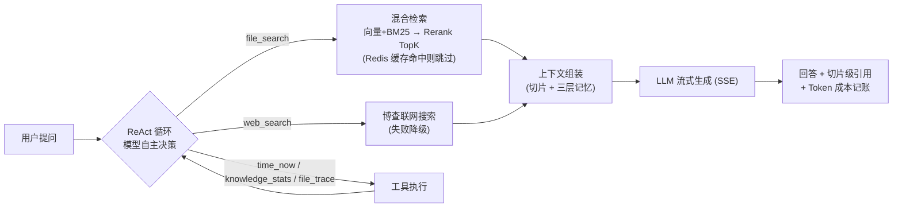

# Ai-Knowledge-Base —— AI 智能图书馆（RAG + Agent 个人知识库）

前后端同仓库的个人知识库：上传 PDF/Word/Markdown 资料，自动解析、切片、向量化入库，支持带引用溯源的流式 RAG 问答与工具调用 Agent。后端 Spring Boot 3 全栈实现（手写 ReAct 循环，非框架编排），已部署生产并通过安全攻防实测。

- **在线演示**：http://120.55.76.141 （演示账号 `demo` / `demo123`，数据按用户隔离）
- 演示路径建议：上传一份 `.md` → 提问资料相关问题 → 看回答附带的切片级引用 → 开"联网"看 Agent 工具选择 → 右下角看每轮 Token 成本

## 功能特性

- 用户注册 / 登录：JWT 无状态认证 + ThreadLocal UserContext，BCrypt 密码，登录防爆破、注册/IP 与聊天/用户限流，`register.enabled` 注册开关
- 知识 CRUD + Markdown 笔记：数据归属权限控制（author == 当前用户），一键导出全部知识为 Markdown（数据主权）
- 文件上传：阿里云 OSS，类型白名单（.pdf/.docx/.md），处理状态机（PROCESSING / SUCCESS / FAILED），PROCESSING 禁删
- 文档处理流水线：PDFBox / POI 解析 → 结构感知切片（structure 模式：按 Markdown 标题/段落/句子边界，chunk 前置章节标题；simple 模式：chunkSize=500 / overlap=100）→ **批量向量化（分批 20 条，比逐条串行快 5-10 倍）** → 批量写入 DashVector
- 向量化与存储：DashScope text-embedding-v3（1024 维）→ 阿里云 DashVector
- RAG 问答：混合检索（向量 + BM25 双路召回 → Rerank 重排），检索结果 Redis 缓存（TTL 5min）+ query embedding 缓存（TTL 1h），上传成功自动失效；SSE 流式生成，回答附切片级引用；检索为空时 Prompt 条件检查防幻觉
- Agent 工具链：手写 ReAct 循环（max_steps=5 死循环防护 + 工具失败错误回传自愈），5 个工具（file_search / file_trace / time_now / knowledge_stats / web_search），联网搜索失败自动降级纯知识库
- MCP Server：Spring AI Streamable HTTP（`/api/mcp-endpoint`），标准 initialize / tools/list / tools/call 全链路
- 三层记忆：工作记忆 / Redis 短期（窗口截断+TTL，挂了降级查 MySQL）/ DashVector 长期（跨会话语义召回 + 治理：去重阈值 0.92 / 保留 180 天 / 单用户上限 500 条 / 超长截断 200 字，全部配置化）
- 成本治理三件套：记账（token_usage 按用户/模型，含流式 Usage 捕获）+ 限流（每用户 10 次/分）+ 每日配额（当日 chat token 达上限拒绝新对话，豁免用户/开关配置化），前端实时展示每轮成本
- 安全加固：全接口数据归属校验（IDOR 修复后口径）、存储侧 XSS 净化（script 块连内容删）、密钥环境变量化 + 历史泄漏扫描

## 当前状态与量化指标

所有数字来自真实实测，可复现（见"测试与安全"一节）。

| 指标 | 数值 | 说明 |
|---|---|---|
| 自动化测试 | 146/146 绿 | 默认回归（e2e 子集由 test-e2e.sh 单独跑，真实调 LLM/向量库） |
| 安全攻防 | 24 项 0 漏洞 | 6 个真漏洞（含 2 个可拖库的 IDOR）修复后生产复测 |
| 变异测试 | 5/5 全红 | 故意注入错误验证测试有效性，同时删掉 9 个零断言假测试 |
| Agent 工具选择 | 15/15 | Eval Harness：该调/不该调用例全对 |
| 检索质量 | recall@5 / MRR 达标（阈值 0.80/0.70，基线 1.0） | v3 数据集 18 查询 / 12 篇文档，真实管线注入非 mock |
| 批量向量化 | 100 chunks 约 30-100s → 5-10s | 批量 embed + 批量 insert，分批 20 + 失败回退逐条 |
| 部署验收 | 9/9 PASS | scripts/verify_deploy.py，看 body 层 code 而非 HTTP 状态 |

## 架构总览



**资料入库（RAG 预处理）：**



**问答链路（RAG + Agent）：**



## 技术栈

| 类别 | 技术 |
|------|------|
| 核心框架 | Java 17、Spring Boot 3.3.4 |
| 持久层 | MyBatis、MySQL 8 |
| 缓存 | Redis（Cache Aside、空值缓存防穿透、随机 TTL 防雪崩、setIfAbsent 分布式锁 + 双重检查防击穿） |
| 认证授权 | JWT + 自定义 Filter + 白名单机制 |
| 对象存储 | 阿里云 OSS |
| AI 能力 | Spring AI Alibaba（DashScope Embedding / LLM）、DashVector、博查 Web Search、MCP（Streamable HTTP） |
| 文档解析 | Apache PDFBox、Apache POI |
| 前端 | Vue 3 + TypeScript + Vite + Element Plus（v-html 渲染 markdown 已套 DOMPurify） |

## 快速开始

环境要求：JDK 17、Maven、MySQL 8.x、Redis，以及阿里云账号（OSS / 百炼 DashScope / DashVector）。

1. 初始化数据库：执行 `docs/schema.sql`

2. 复制配置模板并填入你自己的密钥：

```bash
cd src/main/resources
copy application-local.properties.example application-local.properties   # Windows
# cp application-local.properties.example application-local.properties   # Linux/macOS
```

3. 启动后端：

```bash
mvn spring-boot:run "-Dspring-boot.run.arguments=--server.port=56382"
```

4. 启动前端（开发模式）：

```bash
cd frontend && npm install && npm run dev   # http://localhost:5173,proxy 到 56382
```

## 配置说明

所有敏感配置集中在 `application-local.properties`（已被 .gitignore 忽略），主配置文件只保留 `${}` 占位符：

| 配置项 | 说明 |
|--------|------|
| `spring.datasource.password` | MySQL 密码 |
| `aliyun.oss.access-key-id` / `access-key-secret` | 阿里云 OSS AccessKey（建议用 RAM 子账号） |
| `spring.ai.dashscope.api-key` | 百炼平台 API Key（Embedding / LLM / Rerank） |
| `dashvector.api-key` / `dashvector.endpoint` | DashVector 向量库凭证 |
| `REGISTER_ENABLED` | 注册开关（默认 true；生产建议 false 防陌生人注册） |
| `CHAT_QUOTA_ENABLED` / `CHAT_QUOTA_TOKEN_LIMIT` / `CHAT_QUOTA_EXEMPT_USERS` | 聊天每日配额：开关 / 当日 token 上限（默认 100000）/ 豁免用户逗号分隔（默认作者本人） |
| `memory.governance.*` | 长期记忆治理：去重阈值 / 保留天数 / 容量上限 / 截断长度 |

**请勿将任何真实密钥提交到仓库。**

## 接口一览

所有业务接口以 `/api` 为前缀，返回统一 `Result` 包装（BusinessException → HTTP 200 + body code 500）。

| 方法 | 路径 | 说明 | 认证 |
|------|------|------|------|
| POST | /api/user/register | 用户注册（限流 5 次/分/IP，受 register.enabled 开关控制） | 否 |
| POST | /api/user/login | 登录，返回 JWT（防爆破锁定） | 否 |
| GET | /api/user/{id} | 查询用户（仅允许自查，防枚举） | 是 |
| GET | /api/knowledge | 当前用户知识列表 | 是 |
| GET | /api/knowledge/{id} | 知识详情（Redis 缓存：防穿透/防雪崩/分布式锁防击穿） | 是 |
| POST | /api/knowledge | 新增知识（标题 XSS 入库净化） | 是 |
| PUT | /api/knowledge/{id} | 修改知识（仅作者） | 是 |
| DELETE | /api/knowledge/{id} | 删除知识（仅作者，级联删文件/chunk/向量/缓存） | 是 |
| POST | /api/knowledge/{id}/note | 新建 Markdown 笔记（同步切片+向量化，立刻可检索） | 是 |
| GET | /api/knowledge/export | 一键导出全部知识为 Markdown | 是 |
| POST | /api/file/upload/{knowledgeId} | 上传文件（multipart，白名单 .pdf/.docx/.md）进入 RAG 流水线 | 是 |
| GET | /api/file/list/{knowledgeId} | 知识下文件清单（含处理状态） | 是 |
| GET | /api/file/{id} | 文件详情（作者归属校验） | 是 |
| DELETE | /api/file/{id} | 删除文件（仅作者，PROCESSING 禁删） | 是 |
| POST | /api/chat | 问答（非流式；受每日配额约束，超限返回友好提示） | 是 |
| POST | /api/chat/stream | 问答（SSE 流式；受每日配额约束，超限返回 JSON 错误由前端气泡展示） | 是 |
| GET | /api/chat/history | 对话历史（刷新后恢复） | 是 |
| POST | /api/chat/clear | 清空会话 | 是 |
| GET | /api/token-usage/summary | Token 成本汇总（按用户/模型记账） | 是 |
| POST | /api/mcp-endpoint | MCP 协议端点（Streamable HTTP：initialize / tools/list / tools/call） | 白名单 |

## 测试与安全

- **全量回归**：`mvn test`（默认跑批排除 integration/e2e 分组；e2e 子集 `scripts/test-e2e.sh` 真实调 LLM/向量库产生少量费用）。约定：任何代码改动必须全量回归绿才可提交部署。
- **检索质量评估**：`RetrievalQualityEvalTest`，数据集 `src/test/resources/eval/retrieval-cases.json`（加用例只改 JSON 不动代码），真实管线注入（切片→Embedding→DashVector→混合检索+Rerank），指标 recall@5 / MRR 带回归阈值。
- **工具选择评估**：`EvalHarnessTest`，15 个"该调/不该调"用例，ListAppender 统计。
- **安全攻防**：`scripts/security_attack.py`，24 项检查（攻击者视角：B 拿自己的合法 token 打 A 的资源），退出码=漏洞数，当前 0 漏洞。
- **配额边界**：`ChatDailyQuotaTest`（当日用量 >= 上限即拒 / 多条记录 SUM 聚合口径 / 豁免用户不限 / 开关关闭跳过）。
- **变异测试**：故意注入计费基数错误 / 越权判断反转 / 白名单放行 .exe 等 5 个真实错误，对应测试必须爆红，验证测试体系不是"接口 200 就算过"。
- **部署验收**：`scripts/verify_deploy.py` 9 项检查。

## 部署

生产为阿里云 ECS（2C2G，Ubuntu 22.04）+ systemd `aikb` + Nginx（静态 dist + 反代 /api，SSE 专用 proxy_buffering off）。**严禁在服务器上构建**（会 OOM），本地构建后经 `scripts/deploy.py`（paramiko SSH/SFTP）上传 jar，原子替换 + 重启 + `verify_deploy.py` 9 项验收。详见 `docs/DEPLOY-GUIDE-2026-08-22.md`。

首次部署后，播种演示数据（幂等，重复执行自动跳过已有条目）：

```bash
# 1. 生产 register.enabled=false 时,先临时放开注册建 demo 账号(详见脚本头部说明)
# 2. 播种知识/笔记/文件
python scripts/seed_demo.py
# 3. 可选:发一条问答验证检索链路(消耗少量 LLM 费用)
DEMO_ASK=1 python scripts/seed_demo.py
```

## 路线图

已排期的工程优化（按优先级）：

- 统一 HTTP 连接池（Apache HttpClient5，RestClient / Rerank 共用）
- 大文件流式处理（当前 20MB 内同步读内存）
- DashVector 检索加用户隔离 filter（collection 增长后的性能与隔离）
- 知识列表后端分页
- .doc 老格式支持（当前仅 .docx）
- 检索评估集持续扩充（更长文档 / 更刁钻的 section-locate 用例）

## 许可证

[MIT](LICENSE)。本项目为学习用途，按"现状"提供，不附带任何保证。
