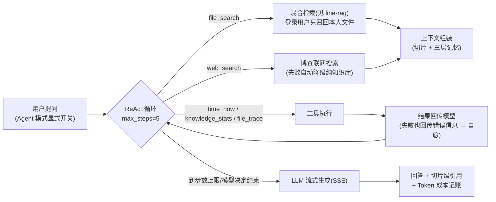

# 业务线二:Agent 编排与上下文治理线

> 内容口径与 `docs/PROJECT-WHYS.md`、`docs/PROJECT-EVIDENCE.md` 一致。

## 定位

Agent 这条线回答三个问题:**模型怎么自主干活**(ReAct 循环)、**干活时怎么不越权不失控**(护栏)、**上下文怎么在多轮间保持连贯且不烧钱**(三层记忆 + 记账)。

## 手写 ReAct 循环(非框架编排)



### 为什么手写循环(WHYS ⑧ + 失败复盘 #3)

- **显式开关而非默认**:Agent 循环 = 多次模型调用 = 延迟与费用都翻倍;普通问答不需要,用户要的是"快"。开关同时是**成本边界**
- **max_steps=5**:死循环是 Agent 第一大生产事故源,强制终止是第一重防护
- **工具失败回传自愈**:不吞错——把错误信息还给模型,让它换参数/换工具,这是第二重防护
- **串行工具调用**:模型曾把并行调用误判成多轮(失败复盘 #3),改串行换确定性

## 工具链与 MCP

| 工具 | 职责 | 隔离保障 |
|---|---|---|
| file_search | 检索用户自己的资料 | 走 searchForUser,与主链路同口径 |
| file_trace | 追溯文件处理轨迹 | 内部走 getFileById,自动继承作者校验 |
| knowledge_stats | 知识库统计 | 按当前用户聚合 |
| time_now | 当前时间 | 无状态 |
| web_search | 联网搜索 | 失败降级,不阻塞对话 |

**MCP Server**:Spring AI Streamable HTTP(`/api/mcp-endpoint`),标准 initialize / tools/list / tools/call 全链路——同一套工具既服务内部 Agent,也暴露给任意 MCP 客户端。

**一次真实的越权教训**(失败复盘 #9,重点):新账号通过 Agent 问"JVM 资料",召回了他人的文件——file_search 工具直接调了全局向量检索,没带用户 filter。修复:工具出口与主链路同口径。**教训:同一安全口径要在每个工具出口独立落实,主链路做了 ≠ 工具链自动继承。**

## 三层记忆

| 层 | 存储 | 策略 |
|---|---|---|
| 工作记忆 | 当前请求上下文 | 单轮内组装 |
| 短期记忆 | Redis(会话历史 List,rightPush + trim + expire) | 窗口截断 + TTL;**Redis 挂了降级查 MySQL,对话不丢** |
| 长期记忆 | DashVector(跨会话语义召回) | 治理四策略:去重阈值 0.92 / 保留 180 天 / 单用户上限 500 条 / 超长截断 200 字,全部配置化 |

**维度绑定教训**:换 embedding 模型(v2→v3)必须重建同维度 collection,否则写入/检索静默失败(1536 vs 1024)——降级逻辑曾掩盖此故障,详见 WHYS。

## 成本治理:Agent 的缰绳

```
记账:token_usage 按用户/模型(含流式 Usage 捕获,Agent 多次调用全部记账——否则绕过治理)
限流:每用户 10 次/分(Redis INCR)
配额:当日 chat token 达上限拒绝新对话(豁免用户/上限/开关配置化)
```

**实测**:Agent 模式 LLM 调用按 userId 记账后,成本面板 2.8k→4.5k tokens 实时可见——一次 Agent 问答的消耗肉眼可见,这就是"把正确的上下文在正确的时刻送进窗口"的代价账。
