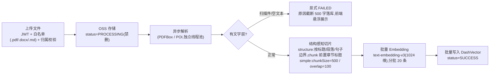
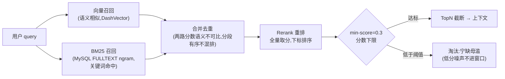

# 业务线一:RAG 检索供给线

> 内容口径与 `docs/PROJECT-WHYS.md`、`docs/PROJECT-EVIDENCE.md` 一致;设计取舍的完整推理链见 WHYS 对应节。

## 定位

检索是这套系统的**输入端**:在配额约束下,把"对的片段"从语料中捞出来送进模型窗口。单路召回谁都会做,这条线的价值在**双路互补、重排宁缺毋滥、缓存治理**三件事上。

## 入库流水线(异步状态机)

关键取舍(详见 WHYS ④⑩⑪⑫):
- **异步化**:接口秒回,处理进度用状态机表达,PROCESSING 禁删防止半成品被引用
- **扫描件显式失败**:比"假装成功但永远检索不到"诚实——失败原因落库可读
- **批量向量化**:100 chunks 从串行 30-100s 降到 5-10s(分批 20 + 失败回退逐条)
- **切片可配置**:simple/structure 双模式,因为"检索 vs 直读"的临界点会随模型价格移动,不能硬编码

## 问答时:混合检索

三条设计原则(详见 WHYS ②⑩⑪):
1. **双路互补**:向量管语义("垃圾怎么分类"),BM25 管关键词命中("Nacos 配置中心")——单独任何一路都有系统性盲区
2. **两路分数不混排**:向量相似度和 BM25 相关度是两种语义,归一化是另一套复杂度;分段有序已够用
3. **min-score 宁缺毋滥**:召回 3 条但 2 条是噪声,不如召回 1 条干净的——检索为空时 Prompt 条件检查防幻觉,而不是硬塞背景

## 缓存治理(Redis)

| 缓存 | TTL | 失效策略 |
|---|---|---|
| 检索结果 | 5min | 上传成功自动失效 |
| query embedding | 1h | 同上 |
| 知识详情 | 随机 TTL | 防穿透(空值缓存)/防雪崩(随机 TTL)/防击穿(setIfAbsent 分布式锁 + 双重检查,锁竞争降级直查 DB) |

## 实测数据

| 指标 | 数值 | 测法 |
|---|---|---|
| 检索质量 | recall@5 / MRR 达标(阈值 0.80/0.70) | 18 查询 / 12 篇文档,真实管线注入(切片→Embedding→DashVector→混合检索+Rerank,非 mock) |
| 批量向量化 | 100 chunks 30-100s → 5-10s | 前后对照实测 |

**已知缺陷(诚实边界)**:需要全文交叉引用的任务上,检索式弱于长上下文直读;临界语料规模见 WHYS 第⑫节(成本/延迟框架)。
